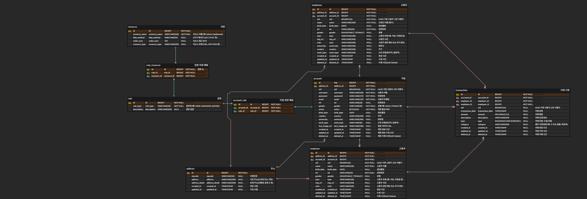

# HireLedger 기능 요구 사항

## 1. 프로젝트 개요

HireLedger는 직업 소개소 직원이 근로자와 고용주를 연결하고, 고용관계와 수수료를 관리할 수 있는 웹 기반 고용 관리 시스템입니다.

소개소 직원은 근로자가 원하는 일자리에 맞춰 회사, 공장, 가정집 등 고용주와 연락을 주선하고 면접을 조율합니다.
고용관계가 성립되면, 근로자와 고용주로부터 수수료를 받고 이를 체계적으로 기록 및 관리할 수 있습니다.

## 2. 주요 기능:

- 근로자와 고용주 관리

- 고용 관계 성립 및 거래 내역 기록

- 수수료 내역 관리 및 통계 확인

- 효율적인 검색 및 필터링 기능 제공

즉, 소개소 직원이 업무를 효율적으로 관리하고, 거래와 수수료 기록을 한눈에 확인할 수 있는 웹 서비스입니다.

---

### 3. ERD




### 4. 기술 스택

| 구분           | 기술                    |
| ------------ |-----------------------|
| 언어           | Java 21               |
| 프레임워크        | Spring Boot 3.5.7     |
| DB           | MySQL 8.0.33          |
| Mapper | MyBatis 3.5.14        |
| DB 마이그레이션    | Flyway                |
| View         | JSP                   |
| 보안           | Spring Security 6.5.6 |


---

### 5. 프로젝트 구조

```
src/main/java
 └─ com.example.hireledger
     ├─ security/           # Security 설정
     ├─ controller/          # JSP 컨트롤러
     │    └─ restcontroller/ # REST API 컨트롤러
     ├─ domain/
     │    ├─ entity/        # DB 매핑 엔티티
     │    ├─ dto/           # Controller ↔ Service DTO
     │    └─ enums/         # Gender, PaymentType 등
     ├─ exception/           # REST API용 예외 처리
     │    ├─ ApiException.java        # 공통 API 예외
     │    ├─ GlobalExceptionHandler.java # @ControllerAdvice 예외 처리
     │    └─ ErrorCode.java          # 오류 코드 정의
     ├─ mapper/             # MyBatis Mapper 인터페이스
     ├─ repository/         # DB 접근 Repository
     ├─ service/            
     │    ├─ assembler/     # DTO ↔ Entity 변환 등 어셈블러
     │    └─ impl/          # 서비스 구현체
     └─ util/               # 공통 유틸 (UUID, 암호화 등)
     
src/main/resources
 ├─ db/migration/          # Flyway 마이그레이션
 ├─ mapper/                # MyBatis XML
 ├─ static/                
 │    ├─ css/              # CSS 파일
 │    └─ js/               # JS 파일
 └─ application.yml        # Spring Boot 설정
 
src/main/webapp
 └─ WEB-INF/views           # JSP

 
```

### 6. Trouble Shooting

[트랜잭션 미적용 오류 해결](https://velog.io/@zvyg1023/%ED%8A%B8%EB%9E%9C%EC%9E%AD%EC%85%98-%EB%B2%94%EC%9C%84%EB%A5%BC-%EC%B5%9C%EC%86%8C%ED%99%94%ED%95%98%EB%A0%A4%EB%8B%A4-%EA%B2%AA%EC%9D%80-%EB%AC%B8%EC%A0%9C%EC%99%80-%ED%95%B4%EA%B2%B0-%EA%B3%BC%EC%A0%95-%EC%A0%95%EB%A6%AC)